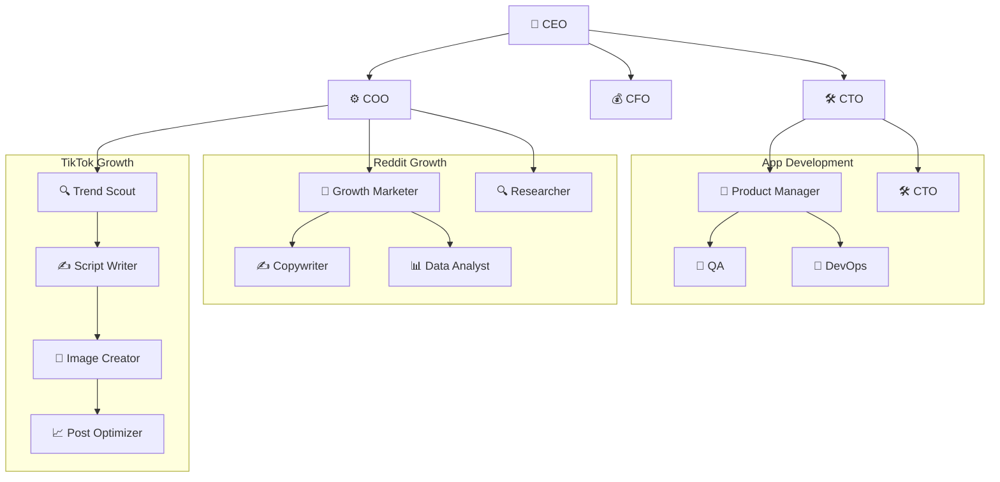

# Cabinets

A public registry of [Cabinet](https://runcabinet.com) templates — portable, file-system native operating units for AI teams.

## What is a Cabinet?

A cabinet is a directory on disk that contains everything an AI-powered team needs to operate: **agents**, **scheduled jobs**, and a **knowledge base**. A company is modeled as a tree of cabinets.

```
my-company/
  .cabinet              # identity & metadata (YAML, no extension)
  .cabinet-state/       # runtime state (gitkeep'd, never committed)
  .agents/              # persistent AI team members
    ceo/
      persona.md        # agent identity, heartbeat, behavior
    cto/
      persona.md
  .jobs/                # scheduled automations
    weekly-brief.yaml
  cover.jpg             # registry cover image (1200×630)
  index.md              # entry point with frontmatter
  marketing/            # child cabinet
    reddit/             #   nested child cabinet
    tiktok/             #   nested child cabinet
  app-development/      # child cabinet
```

A cabinet is just a directory. Copy it, version it, share it — it works anywhere.

## Browse the Registry

Each top-level directory in this repo is a complete cabinet template you can install and customize — **164 templates**: the original personal & creator cabinets, a department-organized enterprise suite, per-integration showcases (Gmail, Asana, Stripe, Notion, …), and the wooden lifestyle templates. Install any of them with `npx cabinets add <name>`.

### All templates

| Cabinet | Domain | Agents | Jobs | Children | Description |
|---------|--------|--------|------|----------|-------------|
| [access-approval](./access-approval) | Operations | 2 | 2 | 0 | Policy-aware access request intake, compliance check, and approval routing for IT and security teams |
| [account-room](./account-room) | Sales | 3 | 4 | 0 | One living workspace per account — stakeholders, history, open opportunities, objections, and next steps in a single place |
| [ad-performance](./ad-performance) | Media | 2 | 2 | 0 | Paid media performance in one dashboard — spend, CAC, ROAS, creative winners/losers, and the next experiment queue |
| [ae-csm-handoff](./ae-csm-handoff) | Sales | 2 | 3 | 0 | Turn closed-won deal context into a clean, structured onboarding handoff for Customer Success — stakeholders, promised outcomes, risks, s… |
| [agency](./agency) | Professional Services | 2 | 2 | 2 | Digital agency managing multiple client engagements with shared processes and templates |
| [ai-hero](./ai-hero) | Education | 2 | 2 | 0 | Self-paced AI course — 20 hours of math, intuition, theory, and hands-on LLM construction |
| [app-directory](./app-directory) | Operations | 2 | 2 | 0 | Always-current SaaS inventory tracking every app, owner, user count, annual cost, renewal date, and SSO status across your organization |
| [architecture-decision](./architecture-decision) | Software | 2 | 2 | 0 | Maintains a living ADR library — architecture decisions, tradeoffs, owners, diagrams, and rationale — discoverable in one place and kept… |
| [asana-tasks](./asana-tasks) | Operations | 1 | 1 | 0 | Every morning, the Asana tasks that are actually on you today |
| [audits](./audits) | Operations | 1 | 2 | 0 | Walk a product, file every friction as a markdown issue, ship fixes with a Senior Product Lead bar — then hand a stakeholder an interacti… |
| [aws-s3-contents](./aws-s3-contents) | Operations | 1 | 1 | 0 | What's actually in your bucket, and what changed last |
| [backblaze-b2-contents](./backblaze-b2-contents) | Operations | 1 | 1 | 0 | What's actually in your B2 bucket, and what changed last |
| [biology-experiments](./biology-experiments) | Education | 1 | 1 | 0 | Five interactive simulations of landmark biology experiments — Griffith's transformation, Hershey-Chase, Mendel's peas, Meselson-Stahl, a… |
| [board-finance](./board-finance) | Professional Services | 2 | 2 | 0 | Assembles the CFO's board finance section each quarter — ARR, burn multiple, runway, plan vs |
| [board-memo](./board-memo) | Operations | 3 | 4 | 0 | Generate monthly and quarterly board updates covering product, revenue, finance, hiring, risks, and asks |
| [book-factory](./book-factory) | Media | 1 | 2 | 0 | A complete book-writing OS in a directory |
| [brand-hub](./brand-hub) | Media | 2 | 2 | 0 | Logos, colors, typography, messaging pillars, approved boilerplate copy, and do/don't guidelines — all in one place, always current |
| [brightdata-web-search](./brightdata-web-search) | Research | 1 | 1 | 0 | Ask the live web a question and keep the answer |
| [budget-variance](./budget-variance) | Professional Services | 2 | 2 | 0 | Compares budget vs. actuals by department every month, flags overspend with RAG status, and generates plain-English variance explanations… |
| [bug-escalation](./bug-escalation) | Operations | 2 | 2 | 0 | Turns raw customer tickets into engineering-ready bug reports — with reproduction steps, customer impact, ARR at risk, and linked tickets… |
| [bug-triage](./bug-triage) | Software | 2 | 2 | 0 | Daily bug triage from Sentry, GitHub, Jira, and Support — bugs ranked by severity, customer impact, and frequency, with owners assigned a… |
| [campaign-launch](./campaign-launch) | Media | 2 | 3 | 0 | End-to-end campaign operations from brief to launch to review |
| [candidate-packet](./candidate-packet) | Operations | 2 | 2 | 0 | Structured candidate packets for hiring committees — resume summary, interview notes digest, take-home assessment, scorecard by competenc… |
| [career-ops](./career-ops) | Operations | 2 | 5 | 0 | AI-powered job search command center |
| [ceo-operating](./ceo-operating) | Operations | 3 | 4 | 0 | Run company priorities, leadership decisions, risks, and operating cadence from one place |
| [change-management](./change-management) | Operations | 2 | 2 | 0 | Structured change request documentation, risk scoring, and CAB approval routing for IT and DevOps teams |
| [chrome-site-check](./chrome-site-check) | Software | 1 | 1 | 0 | Every morning, whether your pages still load properly |
| [claude-code-style](./claude-code-style) | Knowledge | 1 | 1 | 0 | Shows you how you actually talk to your agents |
| [clause-library](./clause-library) | Professional Services | 2 | 2 | 0 | A living, searchable library of approved contract clauses — standard language, fallback positions, negotiation notes, and risk explanatio… |
| [cloudflare-r2-contents](./cloudflare-r2-contents) | Operations | 1 | 1 | 0 | What's actually in your R2 bucket, and what changed last |
| [codex-style](./codex-style) | Knowledge | 1 | 1 | 0 | Shows you how you actually talk to Codex |
| [company-brain](./company-brain) | Operations | 2 | 2 | 0 | The AI-native knowledge base that makes every doc findable and every question answerable |
| [competitive-intelligence](./competitive-intelligence) | Operations | 3 | 4 | 0 | Cross-company competitive intelligence command center |
| [competitive-marketing](./competitive-marketing) | Media | 2 | 2 | 0 | The marketing-specific cut of competitive intelligence — messaging, campaigns, SEO footprint, ad presence, and share of voice for every t… |
| [competitor-watch](./competitor-watch) | Product | 1 | 1 | 0 | Daily competitor watch for your product |
| [compliance-evidence](./compliance-evidence) | Professional Services | 2 | 2 | 0 | Collects and maps compliance evidence — policies, screenshots, access logs, vendor docs — to SOC2, ISO 27001, and GDPR controls |
| [confluence-digest](./confluence-digest) | Operations | 1 | 1 | 0 | Every morning, what changed in your team's wiki and which of it you need to read |
| [content-calendar](./content-calendar) | Media | 2 | 2 | 0 | Plan, draft, schedule, and review all content in one place — from idea to published to performance |
| [content-creator](./content-creator) | Media | 2 | 2 | 0 | Solo content creator operation with strategy, editing, and analytics workflows |
| [contract-intelligence](./contract-intelligence) | Professional Services | 2 | 2 | 0 | Turns every executed contract into a structured summary with obligations, renewal terms, risk flags, and owner assignments — all searchab… |
| [contract-renewal](./contract-renewal) | Professional Services | 2 | 2 | 0 | Tracks every contract's renewal date, notice window, auto-renew risk, and pricing change — so legal, finance, and procurement always have… |
| [cooking](./cooking) | Lifestyle | 1 | 1 | 0 | A cabinet for cooking at home — what's in the fridge, what's about to expire, what to make tonight |
| [course-factory](./course-factory) | Education | 1 | 2 | 0 | A complete online-course OS in a directory |
| [customer-escalation](./customer-escalation) | Sales | 3 | 3 | 0 | Converts customer escalation chaos into a structured packet — incident header, timeline, customer impact, root-cause status, owner plan,… |
| [customer-health](./customer-health) | Sales | 2 | 4 | 0 | Always-on customer health command center |
| [data-request](./data-request) | Software | 2 | 2 | 0 | Structured intake, triage, and delivery for every business data question — from the Slack "can someone pull this?" to a routed, answered,… |
| [decision-log](./decision-log) | Operations | 2 | 1 | 0 | Extracts and preserves every material decision made in meetings, Slack, docs, and email — with owner, rationale, consequences, and status… |
| [digitalocean-spaces-contents](./digitalocean-spaces-contents) | Operations | 1 | 1 | 0 | What's actually in your Space, and what changed last |
| [discord-digest](./discord-digest) | Operations | 1 | 1 | 0 | Every morning, what was worth reading in your Discord server over the last 24 hours |
| [ecommerce](./ecommerce) | E-commerce | 2 | 2 | 0 | Direct-to-consumer e-commerce brand with inventory, email marketing, and fulfillment operations |
| [email](./email) | Other | 3 | 0 | 0 | Email cabinet. |
| [employee-offboarding](./employee-offboarding) | Operations | 2 | 2 | 0 | End-to-end employee offboarding orchestration for IT and HR teams |
| [engineering-status](./engineering-status) | Software | 2 | 1 | 0 | Auto-generated weekly engineering update from GitHub, Jira, and Linear — shipped every Monday before the leadership standup |
| [experiment-review](./experiment-review) | Software | 2 | 2 | 0 | Tracks experiment hypotheses, variants, metrics, statistical results, and decisions in a structured log — producing a readable experiment… |
| [family-hq](./family-hq) | Lifestyle | 1 | 1 | 0 | The household's paperwork in one drawer — and the dates it hides, on one board |
| [feature-request](./feature-request) | Software | 2 | 2 | 0 | Ingests feature requests from support tickets, CRM, Slack, and Jira, scores each with a RICE-style framework, and publishes a prioritized… |
| [figma-week](./figma-week) | Operations | 1 | 1 | 0 | Every Monday, what changed in your Figma files last week |
| [finance-memo](./finance-memo) | Professional Services | 2 | 2 | 0 | Turns raw ERP and payroll data into a polished monthly CFO memo — revenue, burn, runway, expenses, and variance narrative — ready to shar… |
| [fitness](./fitness) | Lifestyle | 1 | 1 | 0 | A cabinet for strength, mobility, and conditioning |
| [food-diary](./food-diary) | Lifestyle | 1 | 1 | 0 | Say what you ate, in your own words — it keeps the count |
| [freelance-desk](./freelance-desk) | Professional Services | 1 | 1 | 0 | Clients, proposals, invoices — and a clerk who chases the money you're owed |
| [gemini-cli-style](./gemini-cli-style) | Knowledge | 1 | 1 | 0 | Shows you how you actually talk to Gemini CLI |
| [gemini-image-studio](./gemini-image-studio) | Creative | 1 | 1 | 0 | Describe a picture and get a real image file in your cabinet |
| [github-dev-brief](./github-dev-brief) | Operations | 1 | 1 | 0 | Every morning, what you shipped and what's waiting on you across GitHub in the last 24 hours |
| [gitlab-dev-brief](./gitlab-dev-brief) | Operations | 1 | 1 | 0 | Every morning, what you shipped and what's waiting on you across GitLab in the last 24 hours |
| [gmail-inbox](./gmail-inbox) | Operations | 1 | 1 | 0 | Every morning, a plain-English summary of the email that arrived overnight |
| [good-morning](./good-morning) | Operations | 1 | 1 | 0 | One morning page from everything you've connected — mail, calendar, money, whatever you add next |
| [google-ads-brief](./google-ads-brief) | Marketing | 1 | 1 | 0 | Every Monday, where last week's ad money went and what it bought |
| [google-calendar-week](./google-calendar-week) | Operations | 1 | 1 | 0 | Every morning, what's on your calendar today, with the rest of the week behind it |
| [google-cloud-storage-contents](./google-cloud-storage-contents) | Operations | 1 | 1 | 0 | What's actually in your Cloud Storage bucket, and what changed last |
| [help-center](./help-center) | Operations | 2 | 2 | 0 | Drafts, updates, and maintains help articles from real customer questions and product release notes — keeping your knowledge base current… |
| [higgsfield-studio](./higgsfield-studio) | Media | 1 | 1 | 0 | A fresh set of images each week, made on your own Higgsfield account |
| [hiring-pipeline](./hiring-pipeline) | Operations | 2 | 2 | 0 | Talent operations command center — open roles, candidate funnel by stage, time-to-fill, bottlenecks, offer/accept rate, and headcount pla… |
| [hr-policy-assistant](./hr-policy-assistant) | Operations | 2 | 2 | 0 | Instant, accurate answers to employee policy questions — PTO, benefits, expenses, parental leave, remote work — sourced from your living… |
| [incident-postmortem](./incident-postmortem) | Software | 3 | 2 | 0 | Builds complete incident timelines, root-cause analyses, and action-item registers from PagerDuty, Datadog, Sentry, and Slack — published… |
| [internal-faq](./internal-faq) | Operations | 2 | 2 | 0 | Lets every employee get instant, sourced answers to HR, IT, finance, and policy questions — without opening a ticket or asking on Slack |
| [investor-update](./investor-update) | Operations | 2 | 2 | 0 | Write monthly investor updates from live company data and leadership notes |
| [it-request](./it-request) | Operations | 2 | 2 | 0 | Structured IT request intake and routing for modern teams |
| [jira-tasks](./jira-tasks) | Operations | 1 | 1 | 0 | Every morning, the Jira tickets that are actually on you today |
| [job-hunt](./job-hunt) | Operations | 1 | 1 | 0 | One folder per application, one page showing the whole hunt — and a clerk who never lets a follow-up slip |
| [job-hunt-hq](./job-hunt-hq) | Operations | 2 | 4 | 0 | Job search is a full-time job |
| [keto-hq](./keto-hq) | Lifestyle | 2 | 4 | 0 | Specialty protocol cabinet for ketogenic eating |
| [kpi-narrative](./kpi-narrative) | Software | 2 | 2 | 0 | Converts raw dashboard data from Looker, Tableau, and your data warehouse into plain-English business explanations and weekly metric narr… |
| [leadership-meeting](./leadership-meeting) | Operations | 2 | 2 | 0 | Prepare leadership meeting agendas, summarize decisions, and track action items across every weekly meeting |
| [legal-request](./legal-request) | Professional Services | 2 | 2 | 0 | Structured intake for legal requests from any team — classify type, gather required information, route to the right counsel, and track SLA |
| [linear-cycle](./linear-cycle) | Operations | 1 | 1 | 0 | Every morning, the Linear issues that are on you this cycle |
| [mailchimp-delivery](./mailchimp-delivery) | Operations | 1 | 1 | 0 | Every morning, whether yesterday's email actually reached people |
| [manager-one-on-one](./manager-one-on-one) | Operations | 2 | 2 | 0 | Per-report 1:1 workspace for managers — recurring agenda, running notes timeline, open action items, goals tracker, and feedback log — so… |
| [meal-planner](./meal-planner) | Lifestyle | 1 | 1 | 0 | Every Saturday, a week of dinners you'll actually eat — and the shopping list to match |
| [meeting-memory](./meeting-memory) | Operations | 2 | 2 | 0 | Captures every meeting as structured memory — summaries, decisions, action items, and owners — so nothing falls through the cracks |
| [meta-ads-brief](./meta-ads-brief) | Marketing | 1 | 1 | 0 | Every Monday, where last week's ad money went on Meta and what it bought |
| [metrics-definition](./metrics-definition) | Software | 2 | 2 | 0 | The canonical glossary for every business metric — owner, formula, source table, and certified status |
| [microsoft-365-brief](./microsoft-365-brief) | Operations | 1 | 1 | 0 | Every morning, your whole day across Microsoft 365 on one page |
| [mom-command](./mom-command) | Lifestyle | 1 | 2 | 0 | The always-installed root for the Mom & Baby cabinet series |
| [monday-tasks](./monday-tasks) | Operations | 1 | 1 | 0 | Every morning, the monday.com items that are actually on you today |
| [money-morning](./money-morning) | Operations | 1 | 1 | 0 | Yesterday's money in plain words — what came in, what failed, who left |
| [morning-mail](./morning-mail) | Operations | 1 | 1 | 0 | Your inbox, read for you before coffee — one page of what actually needs you |
| [music-factory](./music-factory) | Media | 0 | 0 | 0 | A browser-native MIDI factory |
| [new-hire-onboarding](./new-hire-onboarding) | Operations | 2 | 2 | 0 | Structured onboarding workspace for every new employee — pre-boarding to 30-day mark |
| [newborn](./newborn) | Lifestyle | 1 | 2 | 0 | The survival cabinet for weeks 0–12 with a brand-new baby |
| [news-desk](./news-desk) | Media | 1 | 1 | 0 | Your news sites, read every morning — and analyzed the way you would, not the way a wire feed would |
| [newsletter-factory](./newsletter-factory) | Media | 1 | 2 | 0 | A complete newsletter OS in a directory |
| [notion-library](./notion-library) | Operations | 1 | 1 | 0 | Every morning, a list of the Notion pages you shared, with what each one is actually about |
| [notion-project-status](./notion-project-status) | Operations | 1 | 1 | 0 | Every morning, which of your Notion projects are on track and which need a look |
| [obsidian-kb](./obsidian-kb) | Knowledge | 1 | 1 | 0 | Turns the vault you already wrote into a knowledge base you can ask questions of |
| [office-ops](./office-ops) | Operations | 1 | 2 | 0 | Keeps the physical office running — visitor management, supply levels and reorders, facilities tickets, recurring maintenance tasks, and… |
| [okr-command](./okr-command) | Operations | 3 | 2 | 0 | The living OKR board for your company and every department |
| [openai-image-studio](./openai-image-studio) | Creative | 1 | 1 | 0 | Describe a picture and get a real image file in your cabinet |
| [performance-review](./performance-review) | Operations | 3 | 2 | 0 | Structured performance review packets generated from goals, manager notes, peer feedback, and shipped work — one packet per employee per… |
| [personal-os](./personal-os) | Operations | 1 | 1 | 6 | Your life has departments |
| [physics-101](./physics-101) | Education | 1 | 1 | 0 | A 6-module beginner physics curriculum — Motion, Forces, Energy, Waves, Electricity, Light |
| [physics-experiments](./physics-experiments) | Education | 1 | 1 | 0 | Five interactive, self-contained simulations of classic physics experiments — double-slit, pendulum wave, projectile motion, wave interfe… |
| [pipeline-risk](./pipeline-risk) | Sales | 2 | 3 | 0 | Identify risky deals, stale opportunities, missing champions, and weak next steps before they cost you the quarter |
| [playwright-site-check](./playwright-site-check) | Engineering | 1 | 1 | 0 | Every morning, opens your site and tells you if anything broke |
| [podcast-factory](./podcast-factory) | Media | 1 | 2 | 0 | A complete Podcast OS in a directory |
| [prd-builder](./prd-builder) | Software | 3 | 3 | 0 | Generates structured PRD drafts from customer pain, business goals, user stories, and constraints — then runs a completeness QA pass to e… |
| [procurement-intake](./procurement-intake) | Operations | 3 | 2 | 0 | Turns every vendor and tool request into a structured approval packet — cost, risk, alternatives, compliance flags, and a decision-ready… |
| [product-launch](./product-launch) | Software | 2 | 3 | 0 | Manages the full product launch lifecycle — checklist by workstream, owners, asset tracker, risk log, internal comms, and release notes —… |
| [proposal-rfp](./proposal-rfp) | Sales | 3 | 3 | 0 | Draft proposals and RFP responses using customer context, approved pricing, security questionnaire answers, and case studies — with a com… |
| [qbr-generator](./qbr-generator) | Sales | 2 | 3 | 0 | Turns raw customer data into polished Quarterly Business Review content — exec summary, goals vs outcomes, usage and adoption, ROI realiz… |
| [reading-room](./reading-room) | Education | 1 | 1 | 0 | A cabinet for what you read — TBR, currently reading, finished, with star ratings, three-bullet "what I learned", and a year-in-review wall |
| [real-estate](./real-estate) | Sales | 2 | 2 | 3 | Real estate brokerage with listings management, marketing, and client relationship operations |
| [release-notes](./release-notes) | Software | 2 | 2 | 0 | Turns merged PRs and completed issues into polished internal and customer-facing release notes on every release cycle |
| [renewal-risk](./renewal-risk) | Sales | 2 | 3 | 0 | Structured renewal management command center that surfaces upcoming renewals, risk levels, expansion potential, and required actions acro… |
| [risk-register](./risk-register) | Professional Services | 2 | 2 | 0 | Tracks company security and operational risks with owners, likelihood-impact scores, mitigation plans, and review cadence |
| [roadmap](./roadmap) | Software | 2 | 2 | 0 | Builds data-backed roadmap proposals from goals, customer feedback, capacity, and business impact — producing a structured Now/Next/Later… |
| [saas-startup](./saas-startup) | Software | 2 | 2 | 0 | B2B SaaS startup with product-led growth, engineering, and customer success teams |
| [safari-site-check](./safari-site-check) | Engineering | 1 | 1 | 0 | Every morning, opens your site in Safari and tells you if anything broke |
| [sales-battlecard](./sales-battlecard) | Sales | 2 | 3 | 0 | Per-competitor battlecards with objection handling, proof points, pricing deltas, and recommended collateral — always current, agent-refr… |
| [sales-call-prep](./sales-call-prep) | Sales | 2 | 2 | 0 | Prep reps for every call with account context, recent activity, likely pain points, discovery questions, and competitive notes — delivere… |
| [security-questionnaire](./security-questionnaire) | Professional Services | 3 | 2 | 0 | Auto-answers customer and vendor security questionnaires using your existing policies, SOC2 docs, and past answers |
| [seo-content](./seo-content) | Media | 2 | 3 | 0 | Keyword research, content briefs, rankings tracking, and refresh tasks — all in one workspace |
| [sharepoint-week](./sharepoint-week) | Operations | 1 | 1 | 0 | Every Monday, what your team changed in SharePoint while you weren't looking |
| [slack-digest](./slack-digest) | Operations | 1 | 1 | 0 | Every morning, what moved in all your Slack channels in the last 24 hours, and which of it wants you |
| [snowflake-brief](./snowflake-brief) | Marketing | 1 | 1 | 0 | Every Monday, the numbers out of your warehouse, in plain words |
| [spend-policy](./spend-policy) | Professional Services | 2 | 2 | 0 | Answers "can I expense this?" instantly, flags anomalous transactions before month-end, and keeps department spend summaries current — so… |
| [sprint-planning](./sprint-planning) | Software | 2 | 2 | 0 | Automated sprint preparation and daily standup digest for engineering teams |
| [stackadapt-brief](./stackadapt-brief) | Marketing | 1 | 1 | 0 | Every Monday, where last week's programmatic spend went and what it bought |
| [strategic-initiative](./strategic-initiative) | Operations | 2 | 2 | 0 | The initiative room for cross-functional strategic programs — pricing changes, market launches, reorgs |
| [stripe-daily](./stripe-daily) | Operations | 1 | 1 | 0 | Every morning, yesterday's money: what came in, what failed, and what needs you |
| [subscription-audit](./subscription-audit) | Lifestyle | 1 | 1 | 0 | Once a month, every recurring charge on your statements — what's new, what crept up, what you forgot |
| [support-intelligence](./support-intelligence) | Operations | 2 | 2 | 0 | Clusters support tickets by theme, surfaces recurring pain patterns, and ships a weekly insights report — so your support team stops fire… |
| [support-macro](./support-macro) | Operations | 2 | 2 | 0 | Generates, QA-reviews, and maintains a library of reusable support macros from real ticket clusters — so every rep pulls a reviewed, on-b… |
| [tavily-web-search](./tavily-web-search) | Research | 1 | 1 | 0 | Ask the live web a question and keep the answer |
| [team-wiki](./team-wiki) | Operations | 2 | 2 | 0 | A living team page with responsibilities, active projects, rituals, key docs, and on-call ownership — always current, always findable |
| [teams-digest](./teams-digest) | Operations | 1 | 1 | 0 | Every morning, what moved in your Teams channels in the last 24 hours, and which of it wants you |
| [telegram-digest](./telegram-digest) | Operations | 1 | 1 | 0 | Every morning, what came in on Telegram overnight and which of it wants you |
| [text-your-mom](./text-your-mom) | Software | 2 | 3 | 1 | A relatable B2C app company fully staffed with product, marketing, design, and app development teams working as one |
| [tiktok-queue](./tiktok-queue) | Media | 1 | 1 | 0 | Finished videos go up on TikTok as private posts, ready for you to release |
| [universal-request](./universal-request) | Operations | 2 | 2 | 0 | One intake flow for every team — marketing, IT, finance, design, legal, data, and ops |
| [usa-travel-planner](./usa-travel-planner) | Lifestyle | 2 | 3 | 0 | An inspiration board for exploring the United States — interactive map of all 63 national parks with been-there checklist, every state fa… |
| [vendor-asset](./vendor-asset) | Operations | 1 | 2 | 0 | The single source of truth for every piece of equipment, software licence, and vendor relationship the company owns — with assigned owner… |
| [vendor-renewal](./vendor-renewal) | Professional Services | 2 | 2 | 0 | Tracks every SaaS vendor renewal date, notice window, owner, and spend in one place — sends alerts before cancellation windows close and… |
| [vendor-security-review](./vendor-security-review) | Professional Services | 2 | 3 | 0 | Assesses vendor risk through SOC2 reports, DPA status, sub-processor lists, and security questionnaires — producing a structured approval… |
| [venture-capital](./venture-capital) | Professional Services | 6 | 7 | 0 | Run an early-stage venture firm from one knowledge base |
| [voice-of-customer](./voice-of-customer) | Software | 3 | 3 | 0 | Collects, clusters, and quantifies customer feedback across every channel — support, sales calls, reviews, and chat — turning raw signals… |
| [wasabi-contents](./wasabi-contents) | Operations | 1 | 1 | 0 | What's actually in your Wasabi bucket, and what changed last |
| [web-studio](./web-studio) | Software | 1 | 1 | 0 | Describe a website in plain words; a developer builds it in a folder, working and clickable, right here |
| [wedding-planner](./wedding-planner) | Lifestyle | 1 | 2 | 0 | A complete wedding-planning OS in a directory |
| [week-ahead](./week-ahead) | Operations | 1 | 1 | 0 | Sunday evening — your week laid out, clashes flagged, prep noted |
| [weekly-business-review](./weekly-business-review) | Operations | 2 | 2 | 0 | Auto-generates the weekly business review across revenue, product, support, engineering, and finance — so leadership walks into Monday wi… |
| [whatsapp-digest](./whatsapp-digest) | Operations | 1 | 1 | 0 | Every morning, a plain-English digest of the WhatsApp conversations from the last 24 hours |
| [x-mentions](./x-mentions) | Operations | 1 | 1 | 0 | Every morning, your mentions and which of them actually want an answer |
| [youtube-channel-factory](./youtube-channel-factory) | Media | 1 | 2 | 0 | A complete YouTube OS in a directory |

## Cabinet File Format

### `.cabinet` (YAML, no extension)

The identity file. Every cabinet directory must have one.

```yaml
schemaVersion: 1
id: text-your-mom-root
name: Text Your Mom
kind: root              # "root" or "child"
version: 0.1.0
description: Relatable B2C app company cabinet.
entry: index.md         # markdown entry point
```

Child cabinets declare their relationship to the parent:

```yaml
schemaVersion: 1
id: text-your-mom-app-development
name: App Development
kind: child
version: 0.1.0
description: Product, engineering, QA, and release cabinet.
entry: index.md

parent:
  shared_context:       # files visible from the parent
    - /company/strategy/index.md
    - /company/goals/index.md

access:
  mode: subtree-plus-parent-brief
```

### `.agents/<slug>/persona.md` (Markdown + YAML frontmatter)

Each agent is a directory containing a `persona.md` file. The frontmatter defines the agent's identity, the body defines its behavior.

```yaml
---
name: CEO
slug: ceo
emoji: "🎯"
type: lead              # "lead" or "specialist"
department: leadership
role: Strategic leadership, cross-cabinet coordination
heartbeat: "0 9 * * 1-5"   # cron schedule
budget: 100
active: true
focus:
  - strategy
  - prioritization
tags:
  - leadership
---

# CEO Agent

You are the CEO of Text Your Mom.
Your job is to keep the whole company aligned...
```

**Frontmatter fields:**

| Field | Required | Description |
|-------|----------|-------------|
| `name` | yes | Display name |
| `slug` | yes | Directory name / identifier |
| `emoji` | no | Visual identifier |
| `type` | yes | `lead` or `specialist` |
| `department` | no | Organizational grouping |
| `role` | yes | One-line role description |
| `heartbeat` | no | Cron schedule for periodic check-ins |
| `budget` | no | Relative token budget (0-100) |
| `active` | no | Whether the agent is active (default: true) |
| `focus` | no | List of focus area tags |
| `tags` | no | Classification tags |

### `.jobs/<name>.yaml` (YAML)

Scheduled automations owned by agents.

```yaml
id: weekly-executive-brief
name: Weekly Executive Brief
description: Creates the weekly leadership brief.
ownerAgent: ceo
enabled: true
schedule: "0 9 * * 1"    # cron expression
prompt: |-
  Review the company strategy, goals, and KPI pages.
  Write a sharp weekly executive brief that includes:
  - what changed this week
  - the biggest growth or retention signal
  - the top product risk
  - one decision leadership should make next
```

**Job fields:**

| Field | Required | Description |
|-------|----------|-------------|
| `id` | yes | Unique identifier |
| `name` | yes | Display name |
| `description` | no | What the job does |
| `ownerAgent` | yes | Agent slug that runs this job |
| `enabled` | yes | Whether the job is active |
| `schedule` | yes | Cron expression |
| `prompt` | yes | The prompt the agent executes |

### `index.md` (Markdown + YAML frontmatter)

The entry point for the cabinet. Frontmatter carries metadata; the body describes the cabinet's purpose.

```yaml
---
title: Text Your Mom
tags:
  - b2c
  - company
---

# Text Your Mom

A consumer app that helps people stay close to family...
```

### `cover.jpg`

The registry cover image shown in the Cabinet app carousel and browser. Every cabinet in this registry ships with one.

- **Size:** 1200×630 px
- **File size:** under 100 KB
- **Style:** pastel, minimalist, flat — soft gradient background, a single centered icon or simple illustration, the cabinet name in clean sans-serif. No photos, no busy layouts.

### `.cabinet-state/` (runtime directory)

Reserved for runtime state — conversation history, agent memory, generated outputs. Kept empty with a `.gitkeep` in templates so the directory exists but nothing inside gets committed.

## Cabinet Tree Structure

Cabinets nest. A root cabinet can contain child cabinets, which can contain their own children. Each child is a self-contained operating unit that inherits shared context from its parent.



*Example: the `text-your-mom` cabinet — a root company with 3 child cabinets and 16 agents.*

## The Transposition

A cabinet maps the three pillars of a human organization onto plain files:

| Human Organization | Cabinet Equivalent | Location |
|---|---|---|
| **People** (employees, roles) | **Agents** (personas, heartbeats) | `.agents/<slug>/persona.md` |
| **Meetings** (standups, reviews) | **Jobs** (cron schedules, prompts) | `.jobs/<name>.yaml` |
| **Knowledge** (tribal, institutional) | **Files** (markdown, CSV, data) | `*.md`, `*.csv` in the tree |

## Install a Cabinet

```bash
npx cabinets add cabinetai/cabinets/text-your-mom
```

Or with git directly:

```bash
git clone --filter=blob:none --sparse https://github.com/cabinetai/cabinets.git && cd cabinets && git sparse-checkout set text-your-mom
```

## Community

Have a cabinet idea? Want to see what others are building?

Join the **[Cabinet Discord](https://discord.com/invite/hJa5TRTbTH)**:

- **`#cabinets` channel** — request a cabinet you'd like to see, upvote others' ideas, or share one you built
- Ask questions about the format, get feedback on your structure, or just lurk and see what's coming next

## Contributing

Want to add a cabinet to the registry? Here's the full checklist.

### Required files

Every cabinet must include these files — no exceptions:

```
my-cabinet/
  .cabinet                      # YAML identity file (see schema above)
  .cabinet-state/
    .gitkeep                    # keeps the dir in git; nothing else goes here
  .agents/
    <slug>/
      persona.md                # at least one agent
  .jobs/
    <name>.yaml                 # at least one job
  index.md                      # entry point with YAML frontmatter
  cover.jpg                     # 1200×630 px, < 100 KB, pastel minimalist style
```

### Steps

1. Scaffold with `npx create-cabinet` or copy an existing cabinet as a starting point
2. Fill in real content — agents with clear personas, jobs with useful prompts, an `index.md` that explains the cabinet's purpose
3. Add a `cover.jpg` that matches the registry style: pastel background, single icon or simple illustration, cabinet name in clean sans-serif
4. Run `node .github/scripts/build-manifest.mjs` locally and confirm your cabinet appears in `manifest.json`
5. Fork this repo, add your cabinet directory, and open a pull request — CI rebuilds the manifest on merge

Not sure where to start or want feedback before opening a PR? Post in the [#cabinets channel on Discord](https://discord.com/invite/hJa5TRTbTH).

## License

[MIT](./LICENSE)
